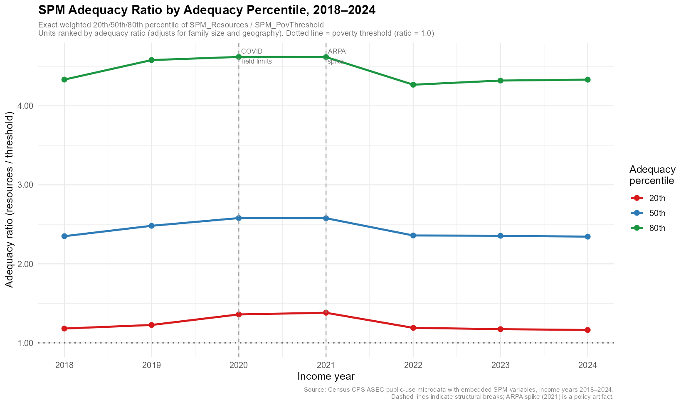

# SPM Adequacy Ratio Analysis

This repository computes the **20th, 50th, and 80th percentile of the SPM adequacy ratio** for each income year from 2018 to 2024, using Census CPS ASEC microdata. It is designed as a forecasting anchor for assessing how living standards may change through 2030–2035.

The adequacy ratio is `SPM_Resources / SPM_PovThreshold` — a single number that tells you how well a family's real resources (income + transfers − taxes − expenses) cover their needs (adjusted for family size and local housing costs). A ratio of 1.0 means exactly at the poverty line. A ratio of 2.0 means twice the poverty threshold. See [methodology.md](methodology.md) for full detail.

---

## Results

### Adequacy ratio at selected percentiles, 2018–2024

| Income year | P20 | P50 | P80 | Notes |
|---|---|---|---|---|
| 2018 | 1.1811 | 2.3499 | 4.3322 | |
| 2019 | 1.2262 | 2.4815 | 4.5791 | Pre-COVID baseline |
| 2020 | 1.3597 | 2.5793 | 4.6190 | COVID field limitations (telephone-only) |
| 2021 | 1.3808 | 2.5774 | 4.6173 | ARPA policy spike (CTC, stimulus, enhanced UI) |
| 2022 | 1.1899 | 2.3591 | 4.2673 | |
| 2023 | 1.1732 | 2.3555 | 4.3198 | |
| 2024 | 1.1628 | 2.3442 | 4.3312 | |

*All three values represent the exact weighted percentile of the adequacy ratio distribution across ~60,000 SPM family units. 1.00 = exactly at the family's own poverty threshold.*

### Trend chart



### Downloadable results

| File | Description |
|---|---|
| [results/spm_adequacy_by_percentile.csv](results/spm_adequacy_by_percentile.csv) | Main result — one row per year × percentile |
| [results/spm_adequacy_summary_wide.csv](results/spm_adequacy_summary_wide.csv) | Wide format — one row per year |
| [results/summary_stats/spm_summary_stats.csv](results/summary_stats/spm_summary_stats.csv) | Rich per-year statistics (income levels, poverty rates, unit characteristics) |

---

## Want to replicate one year yourself?

See the **[single_year/](single_year/)** folder. It contains a single self-contained R script (7 steps, ~30 lines of code) and instructions for downloading the data directly from Census. No other files in this repository are needed.

---

## Data source

**Census CPS ASEC public-use microdata** with embedded SPM variables, income years 2018–2024. Downloaded directly from `https://www2.census.gov/programs-surveys/cps/datasets/`.

The data is **not included** in this repository (files are ~150–200 MB each). The pipeline downloads it automatically; see [Pipeline scripts](#pipeline-scripts) below.

> **Coverage note:** CPS ASEC with embedded SPM variables is only publicly available from income year 2018 onward. ACS-based SPM research extracts exist for 2010–2017 but use a different survey methodology. IPUMS CPS may provide consistent CPS ASEC-based SPM data back to 2010 — see [methodology.md](methodology.md) for details on the data gap.

---

## Pipeline scripts

Run these in order from the project root to reproduce all results from scratch.

| Script | What it does |
|---|---|
| `01_download.R` | Defines the file registry (URLs, local paths). Sourced by other scripts. |
| `02_process_year.R` | Core processing functions: column normalization, loading, weighted percentile. Sourced by other scripts. |
| `03_batch_run.R` | Downloads missing files, processes all years, saves `results/spm_adequacy_by_percentile.csv` |
| `04_visualize.R` | Reads the batch output and saves `results/spm_adequacy_trend.png` |
| `05_summary_stats.R` | Loads raw files again and saves `results/summary_stats/spm_summary_stats.csv` |

**Requirements:** R with packages `data.table`, `ggplot2`, `haven`

```r
install.packages(c("data.table", "ggplot2", "haven"))
```

**To run the full pipeline:**

```bash
Rscript 03_batch_run.R
Rscript 04_visualize.R
Rscript 05_summary_stats.R
```

Run all scripts from the **project root** directory. The first run will download ~1 GB of data; subsequent runs skip already-processed years automatically.

---

## Repository structure

```
/
├── README.md                    ← you are here
├── methodology.md               ← full methodology, caveats, and forecasting notes
├── .gitignore
│
├── results/                     ← all outputs
│   ├── spm_adequacy_by_percentile.csv   ← MAIN RESULT (long format)
│   ├── spm_adequacy_summary_wide.csv    ← wide format
│   ├── spm_adequacy_trend.png           ← trend chart
│   ├── summary_stats/
│   │   ├── spm_summary_stats.csv        ← rich per-year statistics
│   │   └── README.md                    ← column-by-column dictionary
│   └── logs/                            ← run logs (informational)
│
├── single_year/                 ← standalone replication script
│   ├── README.md                ← how to use it
│   ├── single_year.R            ← self-contained 7-step script
│   └── data/
│       └── README.md            ← how to download the data
│
├── 01_download.R                ← pipeline scripts (run from project root)
├── 02_process_year.R
├── 03_batch_run.R
├── 04_visualize.R
├── 05_summary_stats.R
│
├── data/                        ← raw data (gitignored, downloaded automatically)
│   └── raw/
│
└── archive/                     ← development and diagnostic scripts
```

---

## Interpreting the results

- **P20** tracks the bottom fifth of the well-being distribution — families with the fewest resources relative to their needs. Sensitive to transfer program generosity (SNAP, EITC, housing subsidies) and low-wage labor market conditions.
- **P50** tracks the median family. Reflects middle-class wage growth, healthcare costs, and tax policy.
- **P80** tracks the upper-middle range. More sensitive to high-skill wages and capital income.

The **2021 spike** (P20: 1.38, P50: 2.58) reflects ARPA one-time policies (expanded Child Tax Credit, stimulus payments, enhanced unemployment insurance) and is not a structural improvement. **2019 and 2023** are the recommended baseline years for forecasting.

For methodology, limitations, and forward-looking considerations for 2030–2035, see [methodology.md](methodology.md).
